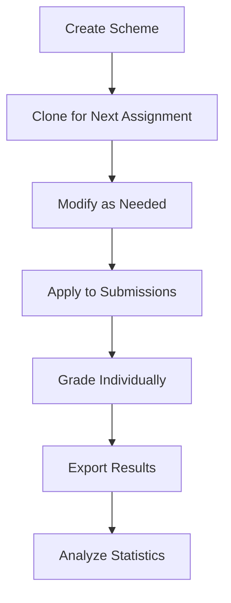

# Grading Schemes User Guide

## Table of Contents

1. [Overview](#overview)
2. [Quick Start](#quick-start)
3. [Creating a Grading Scheme](01-creating-schemes.md)
4. [Grading Submissions](02-grading-submissions.md)
5. [Exporting and Analyzing Results](03-export-analysis.md)
6. [API Reference](04-api-reference.md)

## Overview

The Grading Schemes feature allows you to create reusable, structured rubrics for consistent grading across multiple submissions. A grading scheme consists of:

- **Scheme**: The top-level container (e.g., "Essay Rubric Fall 2025")
- **Questions**: Main grading categories (e.g., "Introduction", "Analysis", "Conclusion")
- **Criteria**: Specific evaluation points within each question (e.g., "Grammar", "Clarity", "Evidence")

### Key Features

✅ **Hierarchical Structure**: Questions contain multiple criteria for detailed evaluation
✅ **Automatic Calculations**: Total points calculated automatically
✅ **Reusability**: Clone and modify schemes for different assignments
✅ **Version Control**: Track changes to schemes over time
✅ **Fractional Points**: Support for decimal precision (e.g., 2.5 points)
✅ **Export & Analytics**: CSV/JSON exports with statistical analysis
✅ **Performance**: Handles large datasets (100+ students × 50+ criteria) efficiently

## Quick Start

### 1. Create a Scheme

Navigate to **Grading Schemes** → **Create Scheme**

```
Scheme: "Essay Rubric Fall 2025"
├── Question 1: "Introduction" (25 points)
│   ├── Criterion: "Thesis Statement" (10 points)
│   ├── Criterion: "Hook/Engagement" (10 points)
│   └── Criterion: "Structure" (5 points)
├── Question 2: "Body Content" (50 points)
│   ├── Criterion: "Evidence Quality" (25 points)
│   └── Criterion: "Analysis Depth" (25 points)
└── Question 3: "Conclusion" (25 points)
    └── Criterion: "Summary & Impact" (25 points)
```

Total: 100 points (calculated automatically)

### 2. Grade Submissions

Once you have submissions, you can:
- Apply the scheme to individual submissions
- Enter points for each criterion (0 to max_points)
- Add feedback for each criterion
- Save as draft or mark complete

### 3. Export Results

Export grading results in multiple formats:
- **CSV**: Spreadsheet-friendly format for Excel/Google Sheets
- **JSON**: Structured data for further processing
- **Statistics**: View usage stats and averages per question/criterion

## Getting Help

- **Creating Schemes**: See [Creating a Grading Scheme](01-creating-schemes.md)
- **Grading**: See [Grading Submissions](02-grading-submissions.md)
- **Exports**: See [Exporting and Analyzing Results](03-export-analysis.md)
- **API**: See [API Reference](04-api-reference.md)

## Best Practices

1. **Naming**: Use descriptive names (e.g., "ENGL101 Essay Rubric Fall 2025")
2. **Granularity**: Break down questions into 2-5 criteria each
3. **Point Distribution**: Make criteria worth 5-25 points for easy grading
4. **Descriptions**: Add descriptions to criteria for clarity
5. **Cloning**: Clone existing schemes rather than starting from scratch
6. **Testing**: Test schemes with sample submissions before bulk grading

## Workflow Example



## Technical Details

- **Database**: PostgreSQL (production) / SQLite (development)
- **API**: RESTful endpoints under `/api/schemes/`
- **Testing**: 538 automated tests, 82% code coverage
- **Performance**: Export 100 students × 50 criteria in <0.3 seconds
- **Data Integrity**: Optimistic locking for concurrent grading
- **Precision**: Decimal(10,2) for accurate point calculations

## Support

For issues or questions:
1. Check the relevant guide in this documentation
2. Review API documentation for endpoint details
3. File an issue in the project repository
